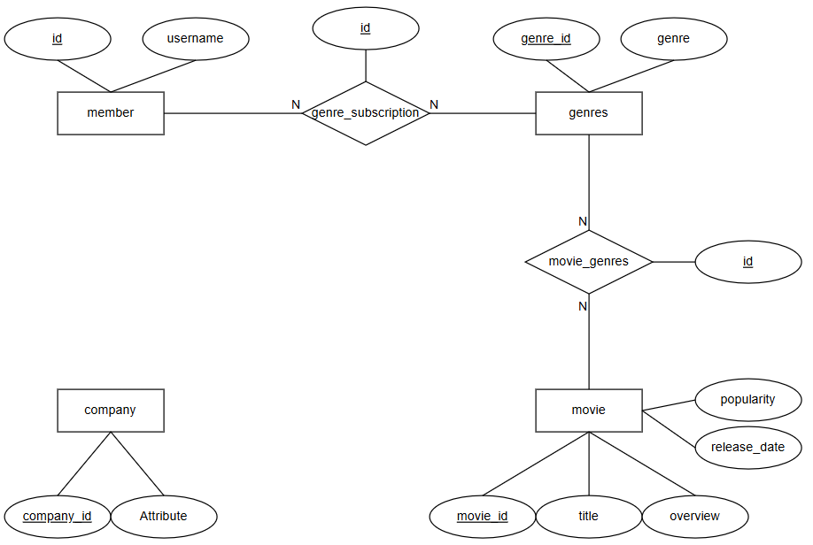

# movie-updater-discord-bot

# Description

This is a discord bot intended to notify users in a server with the upcoming movies releasing in theathers. It allows users to subscribe to specific movie genres, and receiver a more tailored response based on subscribed genres.

# Used technologies

- Programming languages
  - python
- Frameworks
  - Discord.py
- Databases
  - PostgreSQL
- Infrastrucuture
  - Docker (Docker Compose)
  - Cron (Scheduled ETL pipeline)
  - RabbitMQ

# Database

The above image shows the design entity relation model for the bot database. All the movie information was fetched from the TMDB movie API.

- member: Represents the members that have a specific role in the discord server.
- genres: Represents all the movie genres available for a movie.
- movie: Contains all the important information of a movie.
- Company: Contains all the movie companies. Planned to be used in future updates.
- movie_genres: A relationship, that allows to identify which genres a movie has.
- genre_subscription: Identifies the genres a member of the server is subscribed to.

# Bot Features

## Commands

Each command has a demo video, posted on my youtube channel. In order to see the video, just select the demo in one of the commands, or you can find all the videos in my [playlist](https://www.youtube.com/playlist?list=PLWeEhzd1th_saM1B0TwGcwLBxc2Mzyldj).

/ping -> A ping command to test if the bot is alive. [demo](https://youtu.be/if4bIWr39Ak)  
/listCommands -> Returns a list of all the available commands. [demo](https://youtu.be/9EhAZpyh0xQ)  
/subscribe genre -> Allows a user to subscribe to a specific genre. [demo](https://youtu.be/a8aUznwgTdQ)  
/listSubscriptions -> Lists all subscriptions for the member. [demo](https://youtu.be/60j4FlHb69U)  
/upcoming -> Returns only the upcoming movies that have the genres that a user is subscribed to. <!-- [demo]() -->

## ETL Pipeline

The ETL Pipeline, scheduled with a cron job, is responsible to weekly fetch the upcoming movies releasing on theathers. If first starts by fetching a list of the upcoming movies from the TMDB API, applies a simple transformation step, in which it prepares the data to be stored on the DB. As a last step, it stores the data on the database, and publishes a message, with the list of the upcoming movies, on the message broker to be consumed by the bot. A demo video for this process can be found in this link. <!-- [link](). -->

# Attribution

This project integrates with the TMDB (The Movie Database) API to provide up-to-date movie and TV metadata.  
Please note that this product uses the TMDB API but is **not** endorsed or certified by TMDB.
